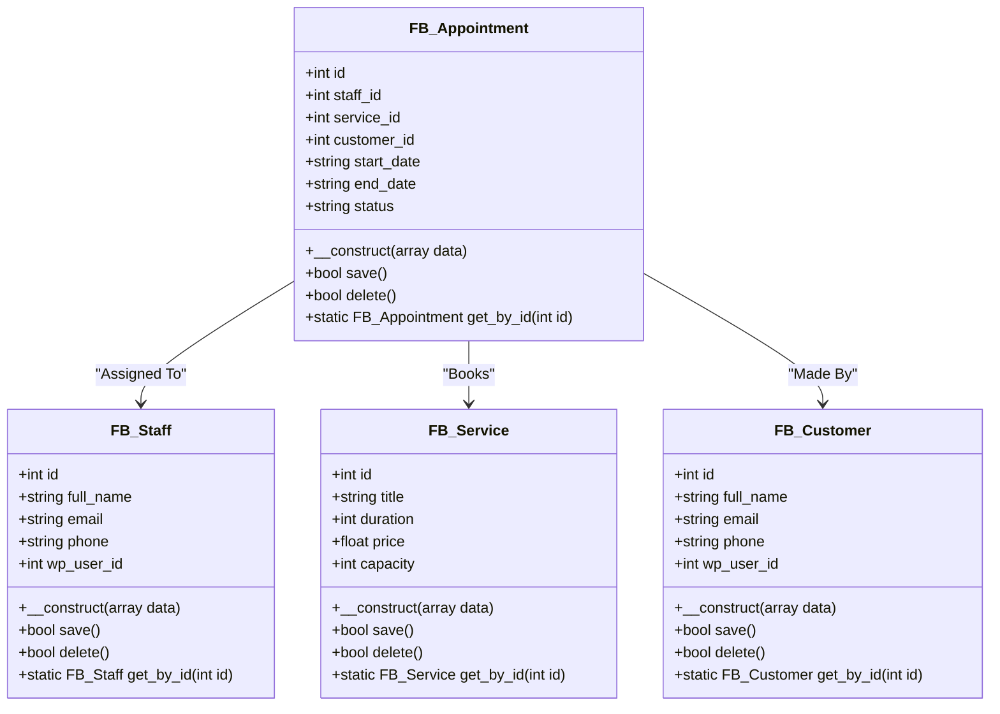

# Class Diagram: Modelli Core (CRUD)

I seguenti diagrammi UML descrivono la struttura delle classi che si occupano di interagire con il database per le entità principali del plugin Free Bookly.

```mermaid
classDiagram
    class FB_Staff {
        +int id
        +string full_name
        +string email
        +string phone
        +int wp_user_id
        +__construct(array data)
        +bool save()
        +bool delete()
        +static FB_Staff get_by_id(int id)
    }

    class FB_Service {
        +int id
        +string title
        +int duration
        +float price
        +int capacity
        +__construct(array data)
        +bool save()
        +bool delete()
        +static FB_Service get_by_id(int id)
    }

    class FB_Customer {
        +int id
        +string full_name
        +string email
        +string phone
        +int wp_user_id
        +__construct(array data)
        +bool save()
        +bool delete()
        +static FB_Customer get_by_id(int id)
    }

    class FB_Appointment {
        +int id
        +int staff_id
        +int service_id
        +int customer_id
        +string start_date
        +string end_date
        +string status
        +__construct(array data)
        +bool save()
        +bool delete()
        +static FB_Appointment get_by_id(int id)
    }

    FB_Appointment --> FB_Staff : "Assigned To"
    FB_Appointment --> FB_Service : "Books"
    FB_Appointment --> FB_Customer : "Made By"
```
